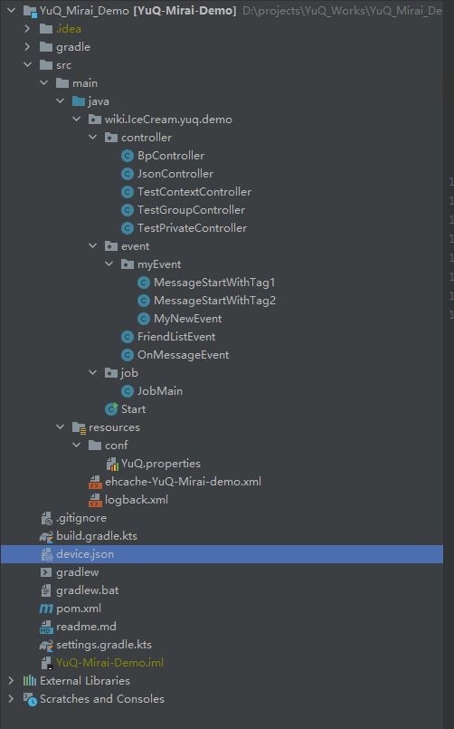
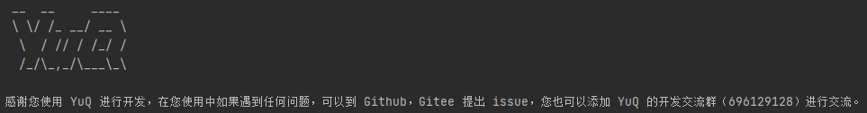

# 第一次启动

## 拉取

:::warning 注意  
请确保你的 JDK 版本 >= 1.8。  
如果出现问题请优先使用1.8版本。  
推荐使用IDEA来进行（这点是个人建议）
:::


:::warning 注意
请确保使用Maven或者Gradle来进行包管理。
:::

从Github拉取YuQ-Mirai-Demo，这是以Mirai为底板的YuQ框架
[YuQ-Mirai-Demo](https://github.com/YuQWorks/YuQ-Mirai-Demo)  
如果在后续想要使用YuQ的ArtQQ或者其他的话，可以[加群]()来获取信息。
在拉取过程中，可以选用Gradle或者Maven其中之一作为包管理器，在Demo中同时准备了这两种配置文件，自行选用更为喜欢的即可。

## 运行

拉取并不是一个麻烦的步骤，在运行之前，不懂的地方使用Goole搜索可能比呆呆的看着文档更为简单，接下来可以来对比一下我们的项目目录了。

### 项目目录图



### 目录解释

首先要说明一点，在一开始，我不建议你更改项目任何地方的代码，因此造成的运行问题会让你也不知道问题在哪里，建议你每个地方都看过运行过再进行二次修改。

 - Start是YuQ启动的地方，由于某些原因，这个地方除非非常娴熟的人，我不建议你添加任何其他代码，否则可能会对YuQ的启动造成一定的干扰。
 - Controller包是类似于MVC框架中的Controller部分，文件中写了相对详细的注释，主要是根据命令来进行反馈（这是YuQ自带的命令系统）
 - Event包是一个触发器系统，当某事发生（比如好友申请）时，想要处理就应该在Event中来进行了。MyEvent是一个自定义事件的Demo，在进阶部分我们会讲到这里。
 - Job包是定时器相关，这里为你介绍了YuQ自带的定时器系统，简单的使用定时器去处理一些东西。
 - Resources的Conf文件夹里面是YuQ的配置文件，如果你有任何自己的配置文件，我建议你另外新建一个文件夹，因为YuQ会扫描外层以及Conf层两层来加载。

现在，在Conf的YuQ.properties中找到`YuQ.Mirai.user.qq`和`YuQ.Mirai.user.pwd`部分，去掉前面的`#`部分，在`=`后面写上你的机器人账号密码，点击Start开始运行吧。  

我明白最显眼的device.json似乎还没有说到，你的目录似乎目前也并没有这个文件，但是别急，这是正常的，现在已经可以运行Start的Main去启动了。

由于是初次登录可能会弹出滑块验证码或者网页扫码登录，点击蓝字打开网页然后使用移动端扫码登录即可。

### 运行成功图


现在，在私聊的窗口对你的机器人说，
```
hello
```
如果你想要群聊的测试，那可以说（如果你的qq是双数，请打开`wiki.IceCream.yuq.demo.controller.TestGroupController`注释掉58行附近的@Before和它的方法，然后重启机器人）。
```
菜单
```
如果没有任何问题，那你也会收到来自机器人的一句话。（关于这部分的代码，请查看Demo中的`wiki.IceCream.yuq.demo.controller.TestPrivateController`和`wiki.IceCream.yuq.demo.controller.TestGroupController`)

#### 关于Device.json
好了，我现在来说明一下device.json，这是Mirai生成的模拟设备文件信息，当你转移自己的机器人时，尽量把他也带走，这样可以有效降低风控。  
如果你不带走，可能每次更换地方登录都需要滑块或者手机验证。  
只有成功登录了，才能说明你的device.json没有问题，其他情况出现的我并不做保证（但是不代表他们不能用，只是一个QQ，最好稳定一个对应的device.json，就好像一个qq固定了一个设备登录）。
